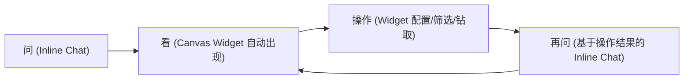

# Neobanker 平台综合设计方案 v2

> 统一 UX 架构 · 工业级视觉系统 · 双轨业务流（传统 + AI 增强）

---

## 目录

- [1. 设计总纲](#1-设计总纲)
- [2. 平台 UX 架构重设计](#2-平台-ux-架构重设计)
  - [2.1 统一布局模式](#21-统一布局模式)
  - [2.2 传统操作控件](#22-传统操作控件)
  - [2.3 Canvas 滚动与通知系统](#23-canvas-滚动与通知系统)
  - [2.4 优雅降级策略](#24-优雅降级策略)
- [3. 视觉设计系统](#3-视觉设计系统)
  - [3.1 配色方案](#31-配色方案)
  - [3.2 字体规范](#32-字体规范)
  - [3.3 图表设计标准](#33-图表设计标准)
  - [3.4 组件交互模式](#34-组件交互模式)
  - [3.5 数据表格规范](#35-数据表格规范)
  - [3.6 Widget 卡片规范](#36-widget-卡片规范)
- [4. 高级交互设计](#4-高级交互设计)
  - [4.1 Smart Component Switcher](#41-smart-component-switcher)
  - [4.2 Platform Component Embedding](#42-platform-component-embedding)
  - [4.3 Chat Embedded Widgets（双态组件）](#43-chat-embedded-widgets)
  - [4.4 Inline Chat 业务流融合](#44-inline-chat-业务流融合)
- [5. 初级复杂度业务流（10 个）](#5-初级复杂度业务流)
- [6. 中高级复杂度业务流（10 个，修订版）](#6-中高级复杂度业务流)
- [7. 能力覆盖矩阵](#7-能力覆盖矩阵)
- [8. 实施优先级](#8-实施优先级)

---

## 1. 设计总纲

### 1.1 设计目标

把 Neobanker 从"AI 聊天 + 展示面板"升级为**完整的银行分析操作平台**。核心要求：

1. **双轨操作**：每项功能都有两条路径 —— 传统 UI 操作（点击/筛选/配置）和 AI 增强（自然语言驱动）。AI 是加速器，不是唯一入口。
2. **优雅降级**：AI/Chatbot 不可用时，用户仍能完成所有核心操作。
3. **工业级视觉**：对标 Bloomberg Terminal / FactSet / Capital IQ 的专业质感，但保持 Neobanker 品牌辨识度。
4. **操作完整性**：用户能选择银行、配置参数、调整图表、生成报告 —— 不是"看一眼"而是"做一套完整分析"。

### 1.2 核心原则

| 原则 | 含义 |
|------|------|
| **AI 增强 ≠ AI 依赖** | 每个功能必须有 UI 操作路径；AI 是快捷方式，不是必要条件 |
| **上下文贯通** | 在任何面板做的操作（选银行、切图表、调参数）都实时同步到其他面板 |
| **渐进复杂度** | 默认界面简洁；高级功能通过展开/配置面板逐步呈现 |
| **数据优先** | 视觉设计服务于数据可读性，而非装饰 |

---

## 2. 平台 UX 架构重设计

### 2.1 统一布局模式

**问题**：当前三种模式（Workspace / Immersive / Canvas Focus）本质是同一布局的三种状态，切换按钮增加认知负担。

**方案**：合并为**单一统一布局**，通过折叠/展开控制面板可见性。

```
┌──────────────────────────────────────────────────────────────┐
│  Header Bar（全局控件：银行选择器 · 工作区标题 · 设置 · 用户）│
├────┬─────────────────────┬──┬────────────────────────────────┤
│ S  │                     │⋮⋮│                                │
│ i  │   Chat Panel        │拖│     Canvas Area                │
│ d  │   （可折叠至 0px）   │拽│    （可滚动 · 可折叠至 0px）   │
│ e  │                     │线│                                │
│ b  │  ┌──────────────┐   │  │  ┌────────┬────────┐          │
│ a  │  │ 对话历史     │   │  │  │Widget 1│Widget 2│          │
│ r  │  │              │   │  │  │        │        │          │
│    │  │ AI 回答      │   │  │  ├────────┼────────┤          │
│ (  │  │              │   │  │  │Widget 3│Widget 4│          │
│ 可 │  │ [输入框]     │   │  │  │        │        │          │
│ 折 │  └──────────────┘   │  │  ├────────┴────────┤          │
│ 叠 │                     │  │  │Widget 5（滚动区）│          │
│ )  │                     │  │  │                  │          │
│    │                     │  │  └──────────────────┘          │
├────┴─────────────────────┴──┴────────────────────────────────┤
│  Status Bar（连接状态 · AI 模型 · 快捷键提示）               │
└──────────────────────────────────────────────────────────────┘
```

**关键交互**：

| 操作 | 行为 | 快捷键 |
|------|------|--------|
| 拖拽中间分割线 | Chat 和 Canvas 比例自由调节（最小 280px / 最大 70%） | — |
| 双击分割线 | 切换到 50/50 等分 | — |
| 折叠 Chat | 分割线滑到最左 → Canvas 全宽（等同原 Canvas Focus） | `⌘⇧C` |
| 折叠 Canvas | 分割线滑到最右 → Chat 全宽（等同原 Immersive） | `⌘⇧F` |
| 折叠 Sidebar | Session 列表收起为图标栏 | `⌘B` |
| 展开 Sidebar | 图标栏展开为完整 Session 列表（宽度 240px） | `⌘B` |

**技术实现**：
- 替换当前 `AnimatePresence` 三路切换为 CSS `resize` + `flex-basis` 拖拽
- 使用 `react-resizable-panels`（allotment 替代方案）处理拖拽分割
- 面板折叠时带 150ms ease-out 动画
- 记住用户上次面板比例到 `localStorage`

### 2.2 传统操作控件

**问题**：当前平台只有 Chatbot 一个操作入口。用户无法不通过 AI 来选择银行、配置图表、调整参数。

**方案**：添加以下传统 UI 控件。

#### 2.2.1 Header Bar（全局工具栏）

```
┌──────────────────────────────────────────────────────────────┐
│ 🏦 Neobanker │ [🔍 搜索/选择银行 ▾] │ ZA Bank │ ⚙ │ 👤 │
└──────────────────────────────────────────────────────────────┘
```

| 控件 | 功能 | 详情 |
|------|------|------|
| **银行选择器** | 下拉搜索 + 选择目标银行 | 输入即搜索，支持名称/代码/SWIFT 模糊匹配；选中后全局上下文切换到该银行 |
| **当前银行标识** | 显示当前聚焦的银行名称 + 状态 | 点击可快速切换最近 5 家银行 |
| **设置按钮** ⚙ | 打开设置面板 | 图表默认参数、数据时间范围、显示偏好、Retail/Enterprise 视图切换 |
| **用户头像** | Clerk 用户信息 | 登录/登出、语言切换、主题切换 |

#### 2.2.2 Canvas 工具栏

```
┌──────────────────────────────────────────────────────────────┐
│ Canvas │ [+ 添加组件] │ 布局: ▦ 网格 │ ▤ 列表 │ ⟳ 重置 │
└──────────────────────────────────────────────────────────────┘
```

| 控件 | 功能 |
|------|------|
| **+ 添加组件** | 打开 Widget 浏览器（所有可用 Widget 类型列表，点击添加到 Canvas） |
| **布局切换** | 网格视图（平铺）/ 列表视图（纵向堆叠） |
| **重置布局** | 恢复默认 Widget 组合和排列 |

#### 2.2.3 Widget 级配置面板

每个 Widget 卡片右上角增加 ⚙ 齿轮图标。点击打开该 Widget 的配置侧边栏：

**BI 图表配置**：
- 图表类型选择（Bar / Line / Area / Radar / Donut）
- 数据源选择（哪些银行、哪些指标）
- 时间范围（FY2020-2025 / 最近 3 年 / 自定义）
- Series 选择（勾选/取消勾选数据列）
- 排序方式（按名称 / 按数值）
- 导出按钮（PNG / CSV / 加入报告）

**对比表配置**：
- 添加/移除对比银行
- 选择对比维度（财务指标子集）
- 高亮规则（最优值 / 阈值报警）

**产品列表配置**：
- 筛选类型（Account / Card / Deposit / Loan / Insurance）
- 排序（按名称 / 按类型 / 按客户分群）

#### 2.2.4 报告生成器（独立 UI 路径）

不依赖 AI，用户可通过传统操作生成报告：

1. Canvas 工具栏 → "📄 生成报告" 按钮
2. 报告构建器面板打开（右侧抽屉 / 模态框）
3. 用户从当前 Canvas 的 Widget 中勾选要纳入报告的内容
4. 拖拽调整报告章节顺序
5. 编辑每个章节的标题和备注
6. 预览 → 导出（HTML / PDF / Markdown）

AI 增强路径：对话中说 "生成报告" → 自动选择最相关的 Widget 内容 → 生成带 AI 分析叙述的报告。

### 2.3 Canvas 滚动与通知系统

#### Canvas 滚动

**问题**：当前 Canvas 最多显示 4 个 Widget（2×2 react-mosaic 网格），且不可滚动。

**方案**：

- **布局引擎变更**：从 react-mosaic 严格平铺切换到 **CSS Grid + 自动行高** 模式
  - 默认 2 列网格：`grid-template-columns: repeat(2, 1fr)`
  - 行高自适应：`grid-auto-rows: minmax(280px, auto)`
  - 容器 `overflow-y: auto`，允许纵向滚动
  - 保留 react-mosaic 作为可选布局模式（"高级平铺"，面向需要精细调整的用户）
- **Widget 数量限制取消**：不再限制 4 个，理论上可以有 N 个
- **懒加载**：滚动到可视区域时才渲染 Widget 内容（`IntersectionObserver`）
- **单列模式**：窗口宽度 <1024px 时自动切换为单列纵向堆叠

#### 通知系统

当 Canvas Orchestrator 自动添加新 Widget 时：

| 场景 | 通知方式 |
|------|----------|
| Canvas 可见 | 新 Widget 入场动画（从右侧滑入 + 2s 边框高亮脉冲） |
| Canvas 不可见（Chat 全宽） | 分割线边缘显示蓝色小圆点 badge + 工具提示 "新增 2 个组件" |
| Widget 被 Orchestrator 替换 | Toast 通知 "📊 Bank Snapshot 已替换为 Comparison Table"（3s 自动消失） |
| Canvas 底部有新内容需滚动 | 底部浮动按钮 "↓ 查看新内容"（点击平滑滚动到最新 Widget） |

### 2.4 优雅降级策略

**原则**：AI 是加速器，不是操作系统。所有功能必须有 UI 备选路径。

| 功能 | AI 路径 | UI 备选路径 |
|------|---------|-------------|
| 选择银行 | 对话中提到银行名 → 自动切换 | Header Bar 银行选择器下拉搜索 |
| 查看银行信息 | "Show me ZA Bank" → 自动弹出 | 选择银行后默认展示 Bank Snapshot Widget |
| 对比银行 | "Compare ZA and Mox" → 自动生成 | Canvas → + 添加组件 → Comparison Table → 配置中选择银行 |
| 生成图表 | "Plot revenue trend" → 自动生成 | Canvas → + 添加组件 → BI Chart → 齿轮配置数据源和图表类型 |
| 筛选产品 | "Show deposit products" → 自动筛选 | Product List Widget 内置 Tab 筛选器 |
| 生成报告 | "Generate report" → 自动生成 | Canvas 工具栏 → 生成报告 → 勾选内容 → 导出 |
| 调整参数 | "Show only last 3 years" → 自动切换 | Widget 齿轮 → 时间范围下拉 |
| 切换图表类型 | "Show as radar chart" → 自动切换 | Widget 内 Chip 选择器（已有） |

**降级模式 UI 指示**：当 AI 服务不可用时，Chat Panel 顶部显示黄色横幅："AI 服务暂时不可用，您可通过工具栏和控件继续操作"。所有 Widget 内的 💬 Inline Chat 图标变灰不可点击。

---

## 3. 视觉设计系统

> 对标研究：Bloomberg Terminal（深色信息密度）、Stripe Dashboard（色彩可及性系统）、FactSet（专业金融数据展示）、Capital IQ（Web 端可用性标杆）。

### 3.1 配色方案

#### 现有问题

当前 `--accent: #ef4444`（亮红色）用作所有交互元素的主色（标签页、按钮、状态指示）。问题不在于红色本身——HSBC (#db0011)、DBS (#e60012)、中银 (#c70000)、平安等亚洲金融巨头都以红色为品牌主色。问题在于红色被**不加区分地铺满了所有交互元素**，没有深色结构底色衬托，缺乏层次感。

#### 新配色方案

**核心思路**：HSBC 模型——深色结构骨架（墨蓝黑）+ 红色品牌主色（深红）+ 冷色中性衬底。红色是品牌的灵魂，但需要深色框架来衬托它的专业感。

| 变量 | 当前值 | 新值 | 用途 |
|------|--------|------|------|
| `--primary` | `#2563eb` | `#dc2626`（深红） | 主交互色：选中标签、活跃按钮、链接、焦点环。比 #ef4444 更沉稳 |
| `--primary-hover` | `#1d4ed8` | `#b91c1c`（暗红） | 主交互色悬停态。更深一级 |
| `--primary-light` | — | `#fef2f2`（红色浅底） | 选中行背景、活跃 Tab 底色。微暖提示 |
| `--accent` | `#ef4444` | `#ef4444`（保留） | 品牌亮红：Logo、CTA 按钮、关键高亮。较 primary 更亮更抢眼 |
| `--accent-hover` | `#dc2626` | `#dc2626`（保留） | CTA 悬停 |
| `--success` | — | `#0d9488`（靛青绿） | 正面指标、增长、合格 |
| `--success-light` | — | `#ccfbf1` | 正面指标浅底 |
| `--warning` | — | `#d97706`（琥珀） | 预警、需关注 |
| `--warning-light` | — | `#fef3c7` | 预警浅底 |
| `--error` | — | `#dc2626`（深红） | 错误、不合格、亏损 |
| `--error-light` | — | `#fee2e2` | 错误浅底 |
| `--background` | `#ffffff` | `#ffffff`（保留） | 页面底色 |
| `--bg-subtle` | `#f5f5f7` | `#f8fafc`（偏蓝白） | 微妙背景（卡片间隔、侧边栏） |
| `--bg-tertiary` | `#f0f0f0` | `#f1f5f9`（蓝灰） | 三级背景（悬停、条纹行） |
| `--foreground` | `#1a202c` | `#0f172a`（墨蓝黑） | 主文本色 |
| `--text-secondary` | `#6b7280` | `#64748b`（石板灰） | 辅助文本 |
| `--text-tertiary` | — | `#94a3b8` | 三级文本（占位符、禁用） |
| `--border-color` | `#e5e7eb` | `#e2e8f0`（蓝灰边框） | 分割线、卡片边框 |
| `--border-focus` | — | `#93c5fd` | 焦点边框（输入框聚焦） |
| `--header-bg` | — | `#0f172a`（墨蓝黑） | 全局 Header Bar 背景 |
| `--sidebar-bg` | — | `#1e293b`（深蓝灰） | Session Sidebar 背景 |

#### 图表色板

不再使用 `BRAND_COLORS = ['#ef4444','#3b82f6',...]` 这种彩虹配色。改用**专业金融数据可视化色板**：

```typescript
export const CHART_COLORS = {
  // 主序列（最多 6 个 series，渐次降低饱和度）
  series: [
    '#1e40af', // 深蓝 — 主指标
    '#0d9488', // 靛青绿 — 第二指标
    '#7c3aed', // 紫罗兰 — 第三指标
    '#d97706', // 琥珀 — 第四指标
    '#64748b', // 石板灰 — 第五指标
    '#0891b2', // 青蓝 — 第六指标
  ],

  // 语义色（财务上下文）
  positive: '#0d9488',   // 盈利、增长、达标
  negative: '#dc2626',   // 亏损、下降、不达标
  neutral: '#64748b',    // 基准线、行业平均
  benchmark: '#94a3b8',  // 对标线（虚线）

  // 单色渐变（同一指标的不同分组时使用）
  blueGradient: ['#1e40af', '#3b82f6', '#60a5fa', '#93c5fd', '#bfdbfe'],
  greenGradient: ['#0d9488', '#14b8a6', '#2dd4bf', '#5eead4', '#99f6e4'],
};
```

**色板使用规则**：
- 单图表最多 5-6 个 series（超过则合并/分组）
- 同类数据用同色系渐变（如"5 家银行的营收"用 `blueGradient`）
- 正/负对比用 `positive` / `negative` 固定语义色
- 基准线/行业平均用 `benchmark` 虚线
- 色盲友好：避免红绿直接对比，使用蓝/橙替代（Bloomberg 同款策略）

### 3.2 字体规范

| 层级 | 字号 | 字重 | 行高 | 用途 |
|------|------|------|------|------|
| H1 | 20px | 700 | 1.3 | 页面标题（极少使用） |
| H2 | 16px | 600 | 1.35 | 区域标题（Widget 标题、面板标题） |
| H3 | 14px | 600 | 1.4 | 子标题 |
| Body | 13px | 400 | 1.5 | 正文、对话内容 |
| Small | 12px | 400 | 1.5 | 辅助信息、表格内容 |
| Caption | 11px | 500 | 1.45 | 图表轴标签、图例、时间戳 |
| Micro | 10px | 500 | 1.4 | Badge、Tag、极小标注 |

**字体族**：`Inter`（已配置）。数字使用 `font-variant-numeric: tabular-nums`（等宽数字，对齐列）。

**数字格式化**：
- 金额：`$1,234.56`（千分位 + 2 位小数）
- 百分比：`12.3%`（1 位小数）
- 大数简写：`$1.2B` / `$345M` / `$12K`
- 负数：红色 + 括号 `($1.2M)` 或红色 + 负号 `-$1.2M`

### 3.3 图表设计标准

> 对标 Bloomberg / FactSet 图表系统 + Tufte 数据墨水比原则。

#### 3.3.1 柱状图 (Bar Chart)

| 属性 | 规范 | 原因 |
|------|------|------|
| 柱宽 | 类别间距的 50%（`barCategoryGap="20%"`） | 金融标准，平衡密度和可读性 |
| 柱角 | 直角（0px radius） | 金融专业标准：直角 = 数据严肃性；圆角 = 消费类/休闲 |
| 分组柱间距 | 2px | 同组内紧密排列 |
| Y 轴起点 | 必须从 0 开始 | 防止视觉误导——不可商量 |
| 网格线 | 水平虚线，1px `#f1f5f9`，仅 Y 轴 | 最小化墨水，不干扰数据 |
| 柱体悬停 | 亮度提升 10%（`opacity: 0.8 → 1.0`）+ 上方数值标签 | 清晰反馈 |
| 选中态 | 2px `--primary` 实线边框 + 其他柱体 `opacity: 0.3` | 聚焦效果 |
| 基准线 | `--benchmark` 虚线 + 右侧小标签 "行业平均" | 提供参照系 |

#### 3.3.2 折线图 (Line Chart)

| 属性 | 规范 |
|------|------|
| 主线粗细 | 2px |
| 辅线粗细 | 1.5px |
| 基准线 | 1px 虚线 `--benchmark` |
| 数据点标记 | 稀疏数据（≤12 点）显示圆点（r=3px）；密集时不显示 |
| 面积填充 | 主线下方 8% opacity 渐变填充 |
| Y 轴 | 不必从 0 开始（折线图的标准做法，突出变化趋势） |
| 悬停 | 垂直辅助线 + 所有 series 的交叉点值显示 |
| 时间标注 | 重大事件（如政策变更）用垂直虚线 + 小标签标注 |

#### 3.3.3 雷达图 (Radar Chart)

| 属性 | 规范 |
|------|------|
| 维度数 | 5-8（低于 5 不适合雷达图，高于 8 拥挤） |
| 网格样式 | 多边形网格（不用圆形），线色 `#e2e8f0` |
| 填充 | 20% opacity 填充 |
| 边线 | 2px series 色 |
| 刻度标签 | 外侧 11px，值标签 10px |
| 多 series | 最多叠加 3 个 series（超过则不可读） |

#### 3.3.4 环形图 (Donut Chart)

| 属性 | 规范 |
|------|------|
| 内径比 | 65%（`innerRadius="65%"`），中心显示总计/标题 |
| 分块间距 | 2px 白色间隔 |
| 标签 | 外侧引导线 + 百分比 + 绝对值 |
| 最大分块 | 8 个（超过则合并为"其他"） |
| 悬停 | 分块外扩 4px + tooltip 显示详情 |

#### 3.3.5 面积图 (Area Chart)

| 属性 | 规范 |
|------|------|
| 填充 | 上色 → 透明渐变（`linearGradient`，起始 30% opacity → 0%） |
| 边线 | 2px 实线 |
| 堆叠 | 默认不堆叠（单 series）；多 series 时可选堆叠模式 |
| 悬停 | 同折线图（垂直辅助线 + 交叉点值） |

#### 3.3.6 Tooltip 设计（所有图表通用）

```
┌────────────────────────┐
│ ZA Bank                │  ← 14px 600 weight，主文本色
│ Revenue: $345.2M       │  ← 13px 400，series 色圆点 + 值
│ YoY: +12.3%            │  ← 12px 400，正面值用 --success
│ vs Industry: +5.1%     │  ← 11px 400，--text-tertiary
└────────────────────────┘
```

| 属性 | 规范 |
|------|------|
| 背景 | `#ffffff`，`border: 1px solid #e2e8f0` |
| 阴影 | `0 4px 12px rgba(0,0,0,0.08)` |
| 圆角 | 6px |
| 内边距 | 10px 14px |
| 定位 | 锚定数据点，避开图表边界（智能翻转） |
| 出现 | 100ms fade-in |
| 数值层级 | 主值最大字号 + 粗体，增减值带颜色，辅助信息灰色小字 |

### 3.4 组件交互模式

#### 3.4.1 按钮

| 类型 | 样式 | 使用场景 |
|------|------|----------|
| **Primary** | `--primary` 背景 + 白字，hover 时加深 | 主要操作（生成报告、确认） |
| **CTA** | `--accent`（#ef4444）背景 + 白字 | 极少使用：注册、购买、核心转化 |
| **Secondary** | 白色背景 + `--primary` 边框 + `--primary` 文字 | 次要操作（取消、更多选项） |
| **Ghost** | 透明背景 + `--text-secondary` 文字 | 工具栏图标按钮、Widget 操作 |
| **Chip/Tag** | `--bg-subtle` 背景 + `--text-secondary` 文字，active 态 `--primary` | 筛选器、图表类型切换 |

**所有按钮**：
- 圆角 6px（按钮） / 12px（Chip 圆角药丸）
- 最小点击区域 32×32px
- 150ms transition
- 禁用态 opacity 0.4 + cursor not-allowed

#### 3.4.2 输入框

| 状态 | 样式 |
|------|------|
| 默认 | `--border-color` 边框，`--bg-subtle` 背景 |
| 聚焦 | `--border-focus`（#93c5fd）边框 + 2px box-shadow `rgba(30,64,175,0.15)` |
| 错误 | `--error` 边框 + 底部错误文字 |
| 禁用 | opacity 0.5，背景 `--bg-tertiary` |

#### 3.4.3 卡片（Widget 外壳）

| 属性 | 规范 |
|------|------|
| 背景 | `--background`（白色） |
| 边框 | 1px `--border-color` |
| 圆角 | 8px |
| 阴影 | 无（默认）/ hover 时 `0 2px 8px rgba(0,0,0,0.04)` |
| 顶部强调线 | 取消当前的彩色 accent bar（emoji + 彩条 = 不专业），改为标题区左侧 3px 竖线 `--primary` |
| 标题区 | 14px 600 weight，左对齐，右侧操作图标（💬 → 改为 SVG icon，⚙ 配置，✕ 关闭） |

### 3.5 数据表格规范

| 属性 | 规范 |
|------|------|
| 表头 | `--bg-subtle` 背景，12px 600 weight `--text-secondary`，`sticky top` |
| 行高 | 36px |
| 条纹行 | 奇数行 `--background`，偶数行 `--bg-subtle` |
| 悬停行 | `--primary-light`（#dbeafe） |
| 选中行 | `--primary-light` 背景 + 左侧 3px `--primary` 边框 |
| 数值列 | 右对齐，`tabular-nums` |
| 正/负值 | 正值 `--success`，负值 `--error` |
| 排序图标 | 当前排序列表头显示 ↑/↓ |
| 单元格内边距 | 8px 12px |

### 3.6 Widget 卡片规范

**取消 emoji 标题**：当前 Widget 标题使用 emoji（🏦 💡 📊 ⚖️），这在 B2B 金融平台中不专业。

**新标题规范**：

| Widget | 当前标题 | 新标题 | 图标方案 |
|--------|----------|--------|----------|
| Bank Snapshot | 🏦 Bank Snapshot | Bank Overview | SVG: building-office |
| BI Chart | 📊 BI Chart | Analytics | SVG: chart-bar |
| Comparison | ⚖️ Bank Comparison | Peer Comparison | SVG: adjustments-horizontal |
| Product List | 🏷️ Products | Product Catalog | SVG: tag |
| AI Suggestions | 💡 AI Suggestions | Recommended | SVG: light-bulb |
| News Feed | 📰 News | Market News | SVG: newspaper |
| Management | 👥 Management | Leadership | SVG: user-group |
| Report | 📄 Report | Report Preview | SVG: document-text |

**图标规范**：使用 `heroicons`（已在 Next.js 生态广泛使用）或 `lucide-react`，统一 16px 描边图标，颜色跟随 `--text-secondary`，active 态跟随 `--primary`。

---

## 4. 高级交互设计

> 本节定义 Assistant 平台独有的高级交互模式。这些交互是平台与传统金融终端的核心差异化能力。

### 4.1 Smart Component Switcher（智能关联组件切换）

**核心概念**：当用户聚焦某个 Widget 时，系统自动推荐与当前内容**最相关的下一步组件**，并提供快捷切换方式。

#### 触发规则

| 用户在 Widget A 上的操作 | 系统推荐的关联 Widget B |
|---|---|
| 查看 Bank Overview (ZA Bank) | → Product Catalog (ZA Bank) / Financial Trend (ZA Bank) |
| 查看 Peer Comparison (ZA vs Mox) | → Radar Chart (ZA vs Mox) / Grouped Bar (ZA vs Mox) |
| 在 BI Chart 上点击某家银行的柱体 | → 该银行的 Bank Overview |
| 在 Product Catalog 上点击某个产品类型 | → 该类型跨银行对比 |
| 在 Financial Trend 上发现异常拐点 | → Proactive Insight（AI 分析原因） |

#### 展示方式：底部悬浮缩略图 Dock

**不采用直接替换**（用户会丢失当前内容）。**不采用旁边弹窗**（干扰阅读）。

采用 **底部 Dock 模式**：

```
┌──────────────────────────────┐
│                              │
│    Widget A                  │
│    (当前聚焦的内容)           │
│                              │
│                              │
├──────────────────────────────┤
│ ← [📊 Trend] [🏦 Overview] [⚖ Compare] → │  ← 底部 Dock（可左右滚动）
└──────────────────────────────┘
```

**Dock 行为**：
- 默认隐藏。用户鼠标悬停 Widget 底部边缘 500ms 或点击 Widget 标题栏的 `⋯` → 显示 Dock
- Dock 内显示 2-4 个缩略图预览卡片（60×40px），每个卡片显示：图标 + 标题 + 1 行数据预览
- 缩略图可左右滚动（如果关联组件 > 4 个）
- **单击缩略图**：在 Canvas 的**下一个可用位置**添加该 Widget（如果 Canvas 有空间）；如果 Canvas 满了，则替换优先级最低的 Widget + Toast "已替换 [X]，点击撤销"
- **拖拽缩略图**：用户可把缩略图拖拽到 Canvas 的任意位置精确放置
- **长按缩略图**：放大预览（200×150px 浮动窗口），松手后缩回

**撤销机制**：替换操作后显示 5s Toast "📊 已替换 AI Suggestions → Financial Trend。[撤销]"。点击撤销恢复原 Widget。

#### 与 Inline Chat 的联动

当用户在 Dock 上的缩略图执行 Inline Chat 追问时，AI 回答会自动将 Dock 中最相关的组件添加到 Canvas。形成**问 → 看 → 再问 → 再看**的自然分析循环。

---

### 4.2 Platform Component Embedding（平台组件嵌入）

**核心概念**：Assistant Canvas 中的 Widget 不仅是自建的分析组件，还可以**直接嵌入现有 bank-info 页面的任何组件**，在 Canvas 框内保持完整交互能力。

#### 架构

现有 bank-info 页面的组件（Overview、Products、Financials、Staff、Marketing、Web3、Tech）本质上是独立的 React 组件。将它们注册到 Widget Registry 中，作为 `platform-embed` 类型的 Widget：

```typescript
type WidgetType =
  | 'bank-snapshot'        // Assistant 原生 Widget
  | 'bi-chart'             // Assistant 原生 Widget
  | ...
  | 'platform-embed';      // ★ 平台页面组件嵌入

interface PlatformEmbedProps {
  route: string;           // 'overview' | 'products' | 'financials' | 'staff' | 'marketing'
  bankSortId: string;      // 当前银行 sortId
  companyId: string;       // 当前银行 companyId
  section?: string;        // 可选：页面内的子区域（如 'company-info' / 'app-ratings'）
}
```

#### 可嵌入的平台组件

| 平台页面 | 可嵌入区域 | 嵌入后的交互 |
|----------|-----------|-------------|
| `/bank-info/[sortId]/overview` | 公司概况、App 评分、股东结构、新闻列表 | 完整：Swiper 轮播、评分星星、链接跳转 |
| `/bank-info/[sortId]/products` | 产品卡片列表 | 完整：展开/收起、链接、标签筛选 |
| `/bank-info/[sortId]/financials` | 财务数据表格 | 完整：排序、翻页 |
| `/bank-info/[sortId]/staff` | 管理层列表 | 完整：头像、背景展开 |
| `/bank-info/[sortId]/marketing` | 营销分析图表 | 完整：图表交互 |

#### 用户操作路径

1. Canvas 工具栏 → "+ 添加组件" → **"Platform Views" 分组** → 选择页面类型
2. 组件在 Canvas 中渲染，与 bank-info 页面上看到的**一模一样**
3. 用户可以在 Canvas Widget 内进行所有操作（滚动、点击、展开）
4. Widget 右上角显示 "📎 Platform View" 标签以区分原生 Widget

#### 双向上下文同步

当用户在 Platform Embed Widget 中进行操作时：
- 操作会同步到 ChatContext（如点击了某个产品 → 上下文注入该产品信息）
- Inline Chat 可以直接对嵌入的平台组件提问
- 如果在 Header Bar 切换了银行，嵌入组件也会自动切换到新银行的数据

#### 技术实现

**不用 iframe**（跨 context 通信复杂、样式隔离问题）。而是：

1. 将 bank-info 页面的核心 UI 提取为**独立的共享组件**（目前它们已经是独立的 `.tsx` 文件）
2. 在 Widget Registry 中注册 `platform-embed` 类型，render 时根据 `route` 动态导入对应组件
3. 通过 `BankContext` 传递银行数据（嵌入组件已经依赖 `BankContext`）
4. 通过 CSS Module 的 scope 避免样式冲突

---

### 4.3 Chat Embedded Widgets（聊天内嵌双态组件）

**核心概念**：AI 回答中嵌入的图表/卡片/控件有**两种渲染态**，根据 Chat 面板的宽度自动切换。

#### 双态设计

| Chat 面板状态 | 宽度 | 组件渲染态 | 交互方式 |
|---|---|---|---|
| **窄态**（Chat + Canvas 并排） | 280-420px | **缩略图态 (Thumbnail)** | 点击 → 在 Canvas 中展开 |
| **宽态**（Chat 全宽 / Immersive） | >600px | **完整态 (Full)** | 直接在 Chat 中交互 |

#### 缩略图态 (Thumbnail Mode)

Chat 面板窄的时候，嵌入组件显示为 **Preview Card**：

```
┌─────────────────────────┐
│ [用户消息]              │
├─────────────────────────┤
│ [AI 回答文本...]        │
│                         │
│ ┌─────────────────────┐ │
│ │ 📊 Revenue Trend    │ │  ← Preview Card (高度 80px)
│ │ ┄┄┄┄╱╲╱╲╱╲┄┄┄┄┄┄  │ │  ← 模糊化的趋势线缩略图
│ │ 4 series · FY20-25  │ │  ← 数据摘要
│ │ [👁 查看] [📌 固定]  │ │  ← 操作按钮
│ └─────────────────────┘ │
│                         │
│ ┌─────────────────────┐ │
│ │ ⚖ Peer Comparison   │ │  ← 另一个 Preview Card
│ │ ZA · Mox · Airstar  │ │
│ │ [👁 查看] [📌 固定]  │ │
│ └─────────────────────┘ │
└─────────────────────────┘
```

**行为**：
- **👁 查看**：在 Canvas 中打开该组件的完整版（Canvas 折叠时自动展开）
- **📌 固定**：组件持久固定到 Canvas（不会被 Orchestrator 替换）
- **悬停 Preview Card**：放大到 200×120px 预览浮窗（显示更多细节，如图表的迷你版），500ms 延迟出现
- **Preview Card 样式**：`--bg-subtle` 背景，1px border，6px 圆角，柔和阴影

#### 完整态 (Full Mode)

Chat 面板宽的时候（全宽模式或 Canvas 折叠），嵌入组件显示为**完整的交互式 Widget**：

```
┌───────────────────────────────────────────────────┐
│ [AI 回答文本...]                                  │
│                                                   │
│ ┌───────────────────────────────────────────────┐ │
│ │ 📊 Revenue Trend                   📌 ⚙ ✕  │ │
│ │ ┌───────────────────────────────────────────┐ │ │
│ │ │                                           │ │ │
│ │ │   完整的交互式折线图                       │ │ │
│ │ │   (悬停 Tooltip · 点击钻取 · 缩放)        │ │ │
│ │ │                                           │ │ │
│ │ └───────────────────────────────────────────┘ │ │
│ │ [Bar] [Line] [Radar] [Table]    导出 ▾       │ │
│ └───────────────────────────────────────────────┘ │
│                                                   │
│ [推荐追问：为什么 2023 年出现拐点？]               │
└───────────────────────────────────────────────────┘
```

**行为**：
- 与 Canvas 中的 Widget **完全相同**的交互能力：Tooltip、图表类型切换、导出、配置
- **📌 固定**：将此组件同步到 Canvas（滚动过去后仍在 Canvas 中保留）
- **⚙ 配置**：原地打开配置面板（数据源、图表类型、series 选择）
- 最大宽度 `min(100%, 760px)`，居中显示
- 组件高度自适应，最小 200px，最大 400px

#### 自动态切换

当用户拖拽分割线改变 Chat 宽度时，组件在两种态之间平滑过渡：
- Chat 宽度 < 500px → 缩略图态（Framer Motion fadeIn/fadeOut 过渡）
- Chat 宽度 ≥ 500px → 完整态
- 过渡期间显示骨架屏（skeleton）避免闪烁

#### Claude Artifacts 对比

| 特性 | Claude Artifacts | Neobanker Chat Widgets |
|------|-----------------|----------------------|
| 内容类型 | 代码、文档、UI 原型 | 金融图表、数据表格、银行卡片、平台控件 |
| 双态渲染 | 侧边栏/内联 | 缩略图(窄)/完整(宽) |
| 数据源 | 静态生成 | 实时银行数据库 + 后端 API |
| 持久化 | 会话内 | 可固定到 Canvas 跨会话保留 |
| 交互深度 | 基础交互 | 完整：配置、钻取、导出、Inline Chat |

---

### 4.4 Inline Chat 业务流融合

**核心概念**：Inline Chat 不只是"对某个 Widget 提问"——它是**驱动整个分析工作流向前推进的引擎**。每一次 Inline Chat 对话都可能触发 Canvas 的连锁编排。

#### Inline Chat 触发的连锁反应

```mermaid
graph TD
    A[用户在 Bank Overview 上<br/>点击 💬 Inline Chat] -->|"Why is NPL so high?"| B[AI 分析原因]
    B --> C[Canvas: 自动添加<br/>NPL Trend Line Chart]
    B --> D[AI 推荐追问:<br/>"Want to see peer NPL comparison?"]
    D -->|用户点击推荐| E[Canvas: 自动添加<br/>Peer NPL Bar Chart]
    E --> F[Smart Switcher Dock 更新:<br/>推荐 Stress Test Widget]
    F -->|用户点击缩略图| G[Canvas: 添加<br/>Risk Dashboard Widget]
```

#### Inline Chat 在具体业务流中的应用

**WF-B2 双银行对比 + Inline Chat 深挖**：

| 步骤 | 操作 | Inline Chat 触发 | Canvas 联动 |
|------|------|-----------------|-------------|
| 1 | 查看 Comparison Table | — | — |
| 2 | Inline Chat 💬："Why is Mox's ROE higher?" | AI 分析原因 | 自动添加 ROE Trend Chart（ZA vs Mox） |
| 3 | AI 回答后推荐："Want to see their product strategies?" | — | — |
| 4 | 用户点击推荐 | — | 自动添加 Product Catalog（Mox）+ Smart Switcher 推荐"Revenue Breakdown" |
| 5 | Inline Chat 💬 on Product Widget："Which Mox products drive the most revenue?" | AI 交叉分析产品与营收 | 自动添加 Donut Chart（Mox 产品营收分布） |

**WF-M1 银行尽调 + Inline Chat 链式推进**：

| 阶段 | 起始 Widget | Inline Chat 问题 | AI 响应 | Canvas 新增 |
|------|-----------|-----------------|---------|------------|
| 财务审查 | Radar 图（6 维健康度） | "Which dimension is the weakest?" | "Cost efficiency 最差，C/I ratio 68%" | C/I Trend Line + Peer Benchmark |
| 管理层评估 | Leadership Widget | "Any red flags in management?" | "CEO 任期短（2 年），CTO 来自..." | News Feed（管理层相关新闻） |
| 产品协同 | Product Catalog | "How much overlap with our portfolio?" | "3/5 产品直接竞争，2 个差异化" | Platform Embed（我方产品页面对比） |
| 报告生成 | 任意 Widget | "Generate DD report from all current widgets" | 报告构建器自动勾选所有 Widget | Report Preview Widget |

#### 业务流中的 "问 → 看 → 操作 → 再问" 循环

这是 Neobanker Assistant 与传统金融终端的根本区别。传统终端是"看 → 操作"（单向），我们是"问 → 看 → 操作 → 再问"（循环）：



每个循环都让 Canvas 更丰富、上下文更深入、分析更完整。最终用户的 Canvas 就是一份完整的分析工作台——可以直接导出为报告。

---

## 5. 初级复杂度业务流

> 日常高频操作，单一目标，3-5 步完成。每个业务流提供**传统操作路径**和 **AI 增强路径**两套操作流程。

---

### WF-B1 单银行信息查询 (Single Bank Lookup)

**角色**：任何用户（分析师、产品经理、管理层）
**场景**：快速查看某家银行的基本信息（位置、规模、产品、财务概况）

#### 传统操作路径

| 步骤 | 用户操作 | 平台响应 |
|------|----------|----------|
| 1 | Header Bar 银行选择器 → 输入 "ZA Bank" | 下拉列表显示匹配结果 |
| 2 | 点击选择 "ZA Bank" | 全局上下文切换到 ZA Bank；Canvas 自动展示 Bank Overview Widget |
| 3 | 查看 Bank Overview 卡片 | 显示：位置、成立时间、CEO、营收、用户数、SWIFT 代码、牌照类型 |
| 4 | 点击 "Products" Tab | Canvas 切换到 Product Catalog Widget |
| 5 | 可选：点击 Widget ⚙ → 调整显示维度 | 配置面板打开，可切换 Retail/Corporate 筛选 |

**涉及平台能力**：银行选择器、Bank Overview Widget、Product Catalog Widget、Widget 配置面板

#### AI 增强路径

| 步骤 | 用户操作 | AI/平台响应 | 涉及能力 |
|------|----------|-------------|----------|
| 1 | Chat 输入："Show me ZA Bank" | Agent 查询银行数据库 | Chatbot 自然语言理解 |
| 2 | — | Canvas 自动弹出 Bank Overview Widget | Canvas Orchestrator 关键词触发 |
| 3 | — | AI 返回摘要文本 + 推荐追问 | Chatbot 结构化回答 + 推荐问题 |
| 4 | 点击推荐问题 "What products does ZA Bank offer?" | Canvas 自动切换到 Product Catalog Widget | 上下文贯通 + Widget 自动编排 |

**AI 增效**：4 步 → 2 步（输入一句话 + 一次点击）；无需知道菜单结构。

**高级交互示例**：
- Bank Overview Widget 底部 Dock 自动显示 [📦 Products] [📊 Financials] [👥 Leadership] 缩略图 → 点击即可在旁边展开（§4.1 Smart Switcher）
- 如果用户想看完整的 bank-info 页面的公司概况（含 App 评分、股东结构），可通过 "+ 添加组件" → "Platform Views" → "Overview Page" 嵌入到 Canvas（§4.2 Platform Embed）
- Chat 中的 AI 回答会内嵌 Bank Overview 的 Preview Card（缩略图态），点击 [👁 查看] 自动在 Canvas 中展开（§4.3 Chat Embedded Widgets）

---

### WF-B2 双银行快速对比 (Quick Bank Comparison)

**角色**：分析师、产品经理
**场景**：快速对比两家银行的核心指标

#### 传统操作路径

| 步骤 | 用户操作 | 平台响应 |
|------|----------|----------|
| 1 | Canvas 工具栏 → "+ 添加组件" → 选择 "Peer Comparison" | Comparison Table Widget 添加到 Canvas |
| 2 | Widget ⚙ → "添加银行" → 搜索选择 ZA Bank + Mox Bank | 对比表自动填充两家银行数据 |
| 3 | Widget ⚙ → 勾选对比维度（Revenue, ROE, NPL Ratio 等） | 表格更新显示所选维度 |
| 4 | 查看自动高亮的最优值 | 最高 Revenue 绿色、最低 NPL 绿色（自动识别正向/反向指标） |
| 5 | 可选：Widget 右上角 "📊" → 切换到柱状图视图 | 对比数据以分组柱状图呈现 |

#### AI 增强路径

| 步骤 | 用户操作 | AI/平台响应 | 涉及能力 |
|------|----------|-------------|----------|
| 1 | "Compare ZA Bank and Mox Bank" | Canvas 自动弹出 Comparison Table + 分组 Bar Chart | Orchestrator 多 Widget 编排 |
| 2 | — | AI 返回对比分析摘要："ZA Bank 营收领先但 NPL 偏高..." | Agent 数据分析 + 自动叙述 |
| 3 | 点击 Comparison Table 的 Inline Chat 💬 → "Why is ZA Bank's NPL so high?" | AI 解释原因 + 自动切换到趋势图 | Inline Chat + 上下文注入 |
| 4 | — | Comparison Table 底部 Dock 自动推荐 [📊 NPL Trend] [🎯 Radar Health] | Smart Component Switcher |
| 5 | 点击 [📊 NPL Trend] 缩略图 | NPL 趋势折线图添加到 Canvas 下方 | Smart Switcher → Canvas 扩展 |

**高级交互闭环**："问 → 看 → 操作 → 再问"循环（§4.4）：对比表 → Inline Chat 追问 → 趋势图自动出现 → Smart Switcher 推荐下一步 → 用户继续深挖

---

### WF-B3 利率 / 产品检索 (Rate & Product Search)

**角色**：产品经理、客户顾问
**场景**：查找特定类型产品的利率或条件

#### 传统操作路径

| 步骤 | 用户操作 | 平台响应 |
|------|----------|----------|
| 1 | Canvas → "+ 添加组件" → "Product Catalog" | Widget 添加到 Canvas |
| 2 | Widget 内 Tab 筛选 → "Deposit" | 只显示存款类产品 |
| 3 | 可选：Widget ⚙ → 按利率排序 | 产品按利率从高到低排列 |
| 4 | 点击感兴趣的产品名称 | 展开产品详情卡片 |

#### AI 增强路径

| 步骤 | 用户操作 | AI/平台响应 |
|------|----------|-------------|
| 1 | "Which HK virtual bank offers the highest deposit rate?" | Agent 查询数据库 → 返回排名 + Product Catalog Widget |
| 2 | — | AI: "ZA Bank Nova Save 提供 3.5% 年利率..." + 自动展示 Product Widget |

---

### WF-B4 财务指标图表生成 (Financial Chart Generation)

**角色**：分析师
**场景**：为某家银行生成特定财务指标的趋势图

#### 传统操作路径

| 步骤 | 用户操作 | 平台响应 |
|------|----------|----------|
| 1 | Header Bar 选择银行 → ZA Bank | 上下文切换 |
| 2 | Canvas → "+ 添加组件" → "Analytics" (BI Chart) | 图表 Widget 添加 |
| 3 | Widget ⚙ → 数据源："Financial Trend" | 图表载入该银行的财务趋势数据 |
| 4 | Widget ⚙ → 图表类型：Line | 切换为折线图 |
| 5 | Widget ⚙ → Series 勾选：Profit Margin + ROE | 只显示两个 series |
| 6 | Widget ⚙ → 时间范围：FY2020-2025 | 调整 X 轴范围 |
| 7 | 可选：点击导出 → PNG | 下载图表图片 |

#### AI 增强路径

| 步骤 | 用户操作 | AI/平台响应 |
|------|----------|-------------|
| 1 | "Show ZA Bank profit margin and ROE trend over the last 5 years" | Canvas 自动生成折线图（2 series） |
| 2 | "Add cost to income ratio to this chart" | Widget 自动添加第 3 个 series |
| 3 | "Export this chart" | 导出 PNG |

**AI 增效**：7 步配置 → 3 步自然语言指令。

---

### WF-B5 银行列表筛选与排序 (Bank List Filtering & Sorting)

**角色**：分析师、战略研究
**场景**：从全部银行中按条件筛选出符合要求的子集

#### 传统操作路径

| 步骤 | 用户操作 | 平台响应 |
|------|----------|----------|
| 1 | Canvas → "+ 添加组件" → "Peer Comparison" | 对比表 Widget 添加 |
| 2 | Widget ⚙ → "全部银行" + 筛选条件（Region: HK, Type: Virtual Bank） | 表格显示符合条件的银行列表 |
| 3 | 点击 "Revenue" 列头 → 降序排列 | 按营收从高到低排列 |
| 4 | 勾选感兴趣的 3 家 → "对比选中" | 自动切换到 3 行对比模式 |

#### AI 增强路径

| 步骤 | 用户操作 | AI/平台响应 |
|------|----------|-------------|
| 1 | "List all HK virtual banks sorted by revenue" | Canvas 弹出对比表（已排序） |
| 2 | "Show me the top 3" | 表格自动筛选到前 3 家 |

---

### WF-B6 数据导出为报表 (Data Export to Report)

**角色**：分析师、管理层
**场景**：将当前 Canvas 的分析内容导出为可分享的报告

#### 传统操作路径

| 步骤 | 用户操作 | 平台响应 |
|------|----------|----------|
| 1 | Canvas 工具栏 → "📄 生成报告" | 报告构建器面板滑出 |
| 2 | 勾选要纳入报告的 Widget（Bank Overview ✓、Chart ✓、Comparison ✓） | 报告预览实时更新 |
| 3 | 拖拽调整章节顺序 | 报告重新排列 |
| 4 | 编辑章节标题 / 添加备注 | 文本编辑器嵌入报告 |
| 5 | 选择格式 → HTML/PDF → 导出 | 文件下载 |

#### AI 增强路径

| 步骤 | 用户操作 | AI/平台响应 |
|------|----------|-------------|
| 1 | "Generate a report for ZA Bank with financials and peer comparison" | 报告自动生成（含 AI 分析叙述 + 图表快照） |
| 2 | "Change the title to 'ZA Bank DD Summary'" | 报告标题更新 |
| 3 | "Export as PDF" | PDF 下载 |

**AI 增效**：5 步手动构建 → 3 步语音/文字指令。且 AI 自动添加分析叙述段落。

---

### WF-B7 监控清单设置 (Watchlist Setup)

**角色**：分析师、基金经理
**场景**：创建一组需要持续关注的银行的监控列表

#### 传统操作路径

| 步骤 | 用户操作 | 平台响应 |
|------|----------|----------|
| 1 | Header Bar → ⚙ 设置 → "Watchlist" Tab | 监控清单管理界面打开 |
| 2 | "+ 添加银行" → 搜索选择多家银行 | 银行添加到清单 |
| 3 | 设置监控指标（Revenue, ROE, NPL） | 每项指标显示当前值 + 变化趋势 |
| 4 | 设置阈值报警（如 NPL > 3% 触发提醒） | 保存报警规则 |
| 5 | 返回主界面 → Canvas 自动显示 Watchlist 摘要 Widget | 实时显示监控银行的关键指标变化 |

#### AI 增强路径

| 步骤 | 用户操作 | AI/平台响应 |
|------|----------|-------------|
| 1 | "Create a watchlist with ZA Bank, Mox Bank, and Airstar. Monitor ROE and NPL." | 监控清单自动创建 + Canvas 显示 Watchlist Widget |
| 2 | "Alert me if any bank's NPL exceeds 3%" | 报警规则自动设置 |

---

### WF-B8 趋势分析 (Trend Analysis)

**角色**：分析师
**场景**：分析一个指标在多家银行中的历史趋势

#### 传统操作路径

| 步骤 | 用户操作 | 平台响应 |
|------|----------|----------|
| 1 | Canvas → "+ 添加组件" → "Analytics" | 图表 Widget |
| 2 | Widget ⚙ → 数据源："Multi-Bank Comparison" | 载入多银行数据 |
| 3 | Widget ⚙ → 选择银行（ZA, Mox, Airstar, Livi） | 4 条 series |
| 4 | Widget ⚙ → 指标："Revenue" → 图表类型："Line" | 折线图叠加 4 家银行 |
| 5 | 鼠标悬停查看各年数值 | Tooltip 显示所有银行在该年份的值 |
| 6 | 可选：点击某银行线条 → 自动弹出该银行 Bank Overview | Smart Component Switcher 触发 |

#### AI 增强路径

| 步骤 | 用户操作 | AI/平台响应 |
|------|----------|-------------|
| 1 | "Compare revenue trend of ZA Bank, Mox, Airstar, Livi over last 5 years" | 多线折线图自动生成 |
| 2 | "Who's growing the fastest?" | AI 计算 CAGR + 回答 + 高亮最快增长线 |

---

### WF-B9 产品对标 (Product Benchmarking)

**角色**：产品经理
**场景**：对比多家银行的同类产品（如储蓄产品）

#### 传统操作路径

| 步骤 | 用户操作 | 平台响应 |
|------|----------|----------|
| 1 | Canvas → "+ 添加组件" → "Product Catalog" | Widget 添加 |
| 2 | Widget ⚙ → 选择多家银行 | 产品列表合并显示 |
| 3 | Widget 内 Tab → "Deposit" | 筛选储蓄类产品 |
| 4 | 点击排序按钮 → 按利率排序 | 所有银行的储蓄产品按利率排列 |
| 5 | 可选：选中 3 款产品 → 右键 "对比选中产品" | 弹出产品对比侧边栏 |

#### AI 增强路径

| 步骤 | 用户操作 | AI/平台响应 |
|------|----------|-------------|
| 1 | "Compare deposit products across HK virtual banks, sort by interest rate" | 自动生成产品对比表 |
| 2 | "Which one is best for a retail customer with $100K?" | AI 分析并推荐 + 解释原因 |

---

### WF-B10 会话摘要与分享 (Session Summary & Share)

**角色**：任何用户
**场景**：将当前分析会话的关键发现整理为可分享的摘要

#### 传统操作路径

| 步骤 | 用户操作 | 平台响应 |
|------|----------|----------|
| 1 | Chat 面板工具栏 → "摘要" 按钮 | 对话历史被压缩为结构化摘要 |
| 2 | 编辑摘要内容（增删要点） | 文本编辑器 |
| 3 | 选择分享方式 → 复制链接 / 导出 Markdown | 生成分享链接或文件 |

#### AI 增强路径

| 步骤 | 用户操作 | AI/平台响应 |
|------|----------|-------------|
| 1 | "Summarize today's analysis" | AI 自动提取关键发现 + 数据点 + 生成结构化摘要 |
| 2 | "Share this with my team" | 摘要导出为 Markdown + 生成分享链接 |

---

## 6. 中高级复杂度业务流

> 多步骤、跨数据源、需要分析判断的复杂流程。保留原有 10 个业务流，增加**传统操作路径**和更详细的**AI 交互步骤**。

---

### WF-M1 银行尽职调查 (Bank Due Diligence)

**角色**：投行分析师 / PE 投资经理
**复杂度**：6-8 步，跨 3+ 数据维度，产出完整 DD 报告

#### 传统操作路径

| 步骤 | 用户操作 | 平台响应 |
|------|----------|----------|
| 1 | Header Bar 银行选择器 → 选择目标银行 | 上下文切换 |
| 2 | Canvas 自动展示 Bank Overview | 基本信息卡片 |
| 3 | Canvas → "+ 添加组件" → "Analytics" → ⚙ 配置：Financial Trend + Radar | 两个图表 Widget 并排 |
| 4 | Canvas → "+ 添加组件" → "Leadership" → 查看管理层 | Management Widget |
| 5 | Canvas → "+ 添加组件" → "Product Catalog" | 产品组合 |
| 6 | Canvas → "+ 添加组件" → "Peer Comparison" → ⚙ 添加对标银行 | 同业对比表 |
| 7 | 逐个 Widget 核查数据，做笔记 | 各 Widget 支持"备注"功能 |
| 8 | Canvas 工具栏 → "生成报告" → 勾选所有 Widget → 导出 PDF | DD 报告下载 |

#### AI 增强路径

| 步骤 | 用户操作 | AI/平台响应 | 涉及能力 |
|------|----------|-------------|----------|
| 1 | "I need to do due diligence on ZA Bank" | Canvas 自动编排：Bank Overview + AI Suggestions（推荐 DD 检查清单） | Orchestrator 多 Widget 编排 |
| 2 | 点击 AI 推荐："Financial Health Check" | Canvas 自动添加 Radar 图（6 维健康度）+ 趋势折线图 | 推荐问题 → Orchestrator 联动 |
| 3 | "Compare with peers" | Comparison Table 自动弹出（自动选择同 region 同类型银行） | Agent 智能选择对标银行 |
| 4 | Inline Chat on Radar 💬 → "Why is cost/income so high?" | AI 分析原因 + 自动切到 C/I 趋势图 | Inline Chat + 上下文注入 + Widget 联动 |
| 5 | "Show me the management team" | Leadership Widget 弹出 + AI 自动摘要背景 | Management Widget + AI 摘要 |
| 6 | "Generate DD report" | 自动选择所有相关 Widget → 生成含 AI 分析叙述的报告 → 导出 | 报告生成器 + AI 叙述 |

**AI 增效**：8 步手动配置 → 6 步对话驱动。更重要的是：AI 自动选择对标银行、自动生成分析叙述，减少人工判断的重复工作。

---

### WF-M2 竞争格局分析 (Competitive Landscape Analysis)

**角色**：银行战略部门 / 咨询公司分析师
**复杂度**：覆盖 10+ 参与者，多维指标，市场地图

#### 传统操作路径

| 步骤 | 用户操作 | 平台响应 |
|------|----------|----------|
| 1 | Canvas → "Peer Comparison" → ⚙ 选择所有 HK Virtual Banks | 全量银行对比表 |
| 2 | 按 Revenue 排序 → 查看整体分布 | 排序后表格 |
| 3 | Canvas → "Analytics" → ⚙ Grouped Bar → 多银行多指标 | 分组柱状图 |
| 4 | Canvas → "Analytics" → ⚙ Radar → 选 3 家对标 | 雷达图叠加 |
| 5 | Canvas → "Product Catalog" → ⚙ 全银行 + 按类型汇总 | Donut 图显示品类分布 |
| 6 | 基于以上数据手动撰写分析 | — |

#### AI 增强路径

| 步骤 | 用户操作 | AI/平台响应 | 涉及能力 |
|------|----------|-------------|----------|
| 1 | "Analyze the competitive landscape of HK virtual banks" | Canvas 编排：Comparison Table（全量）+ Grouped Bar + Radar（前 3）| 一句话驱动多 Widget |
| 2 | — | AI 自动生成竞争格局摘要 + Proactive Insight | Agent 分析 + Proactive Insights Widget |
| 3 | "Who has the best product diversification?" | Donut 图对比各银行产品分布 + AI 分析 | Product Widget + Donut + AI 叙述 |
| 4 | "Generate competitive analysis report" | 完整报告含图表快照 + AI 叙述 | 报告生成器 |

---

### WF-M3 并购标的筛选与估值 (M&A Target Screening)

**角色**：投行 M&A 部门 / 战投部
**复杂度**：从几十家候选筛选到短名单 + 初步估值

#### 传统操作路径

| 步骤 | 用户操作 | 平台响应 |
|------|----------|----------|
| 1 | Peer Comparison → ⚙ 全量 + 筛选条件（Revenue > 50M, ROE > 5%） | 筛选后列表 |
| 2 | 排序 + 手动选出 3-5 家进入短名单 | 标记选中银行 |
| 3 | 对选中银行添加 Analytics（Grouped Bar 关键指标）| 财务对比图 |
| 4 | 添加 Leadership Widget 逐家查看管理层 | 管理层信息 |
| 5 | 添加 Product Catalog → 交叉分析产品协同 | 产品重叠分析 |
| 6 | 手动计算 P/E、P/B 等估值指标 | — |
| 7 | 生成报告 → Investment Memo | 报告导出 |

#### AI 增强路径

| 步骤 | 用户操作 | AI/平台响应 | 涉及能力 |
|------|----------|-------------|----------|
| 1 | "Screen HK banks with revenue > 50M and ROE > 5%" | Comparison Table 自动筛选 | Agent 结构化查询 |
| 2 | "Narrow down to top 3 by overall health" | AI 用 Radar 综合评分 → 推荐前 3 | Agent 多维评分 |
| 3 | "Analyze product synergies with our portfolio" | AI 交叉分析 + Product Widget 标注重叠 | Agent 交叉分析 |
| 4 | "Generate investment memo" | 完整 Investment Memo + 图表 + AI 叙述 | 报告生成器 |

---

### WF-M4 产品创新对标 (Product Innovation Benchmarking)

**角色**：产品经理 / 创新实验室
**复杂度**：跨银行产品对比 + 创新洞察

#### 传统操作路径

| 步骤 | 用户操作 | 平台响应 |
|------|----------|----------|
| 1 | Product Catalog → ⚙ 全银行 + 特定产品类型 | 跨银行产品列表 |
| 2 | 逐个查看产品描述 → 手动标注创新点 | — |
| 3 | 手动整理对标矩阵 | — |

#### AI 增强路径

| 步骤 | 用户操作 | AI/平台响应 | 涉及能力 |
|------|----------|-------------|----------|
| 1 | "Show me all deposit products across HK banks" | Product Catalog Widget（全银行） | Agent 查询 |
| 2 | "Which products have unique features?" | AI 分析 + 标注差异化产品 | Agent 文本分析 |
| 3 | "Create an innovation benchmark matrix" | 自动生成矩阵 + Proactive Insight | 报告生成器 |

---

### WF-M5 投资组合健康监控 (Portfolio Health Monitoring)

**角色**：基金经理 / 资产管理
**复杂度**：持续监控多家银行 + 预警

#### 传统操作路径

| 步骤 | 用户操作 | 平台响应 |
|------|----------|----------|
| 1 | 设置 → Watchlist → 添加持仓银行 | Watchlist 创建 |
| 2 | 设置监控指标 + 阈值 | 报警规则 |
| 3 | 每日查看 Watchlist Widget | 指标变化 + 颜色编码 |
| 4 | 指标异常 → 点击进入该银行详细分析 | Bank Overview + Analytics |
| 5 | 生成月度组合健康报告 | 报告导出 |

#### AI 增强路径

| 步骤 | 用户操作 | AI/平台响应 | 涉及能力 |
|------|----------|-------------|----------|
| 1 | "Monitor ZA, Mox, Airstar — alert me on NPL or revenue changes > 10%" | Watchlist 自动创建 + 报警规则 | Agent 理解 + Watchlist Widget |
| 2 | AI 主动推送："ZA Bank NPL 本季上升 15%，建议关注" | Proactive Insights Widget 弹出 | Proactive Insights + Push 通知 |
| 3 | "Generate portfolio health report" | 自动报告 + 异常分析叙述 | 报告生成器 + AI 叙述 |

---

### WF-M6 市场进入策略研究 (Market Entry Strategy)

**角色**：银行战略部 / 咨询公司
**复杂度**：新市场全景分析 + 进入建议

#### 传统操作路径

| 步骤 | 用户操作 | 平台响应 |
|------|----------|----------|
| 1 | Peer Comparison → ⚙ 选择目标市场所有银行 | 市场全量列表 |
| 2 | Analytics → Grouped Bar（市场结构：按规模分段） | 市场结构可视化 |
| 3 | Product Catalog → 按产品类型统计各银行覆盖 | 产品覆盖矩阵 |
| 4 | Analytics → Donut（市场份额分布） | 市场集中度可视化 |
| 5 | 手动分析进入机会 | — |

#### AI 增强路径

| 步骤 | 用户操作 | AI/平台响应 | 涉及能力 |
|------|----------|-------------|----------|
| 1 | "Analyze Hong Kong virtual banking market for entry opportunities" | Canvas：市场全景（Comparison Table + Grouped Bar + Donut） | Orchestrator 多 Widget |
| 2 | — | AI Proactive Insight："储蓄类产品竞争激烈，但 SME 贷款覆盖不足" | Proactive Insights |
| 3 | "What specific product should we launch first?" | AI 推荐 + 竞品空白分析 | Agent 分析 + Product Widget |

---

### WF-M7 监管合规交叉审查 (Regulatory Compliance Cross-Check)

**角色**：合规官 / 法务
**复杂度**：跨银行合规状态对比

#### 传统操作路径

| 步骤 | 用户操作 | 平台响应 |
|------|----------|----------|
| 1 | Peer Comparison → 筛选显示合规相关字段（License Type, Jurisdiction, Regulator） | 合规对比表 |
| 2 | 逐行核查各银行的牌照状态 | — |
| 3 | 标注不合规项 → 生成合规审查报告 | 报告导出 |

#### AI 增强路径

| 步骤 | 用户操作 | AI/平台响应 | 涉及能力 |
|------|----------|-------------|----------|
| 1 | "Check compliance status of all HK virtual banks" | Comparison Table（合规维度自动选中）+ AI 自动标注异常 | Agent 结构化查询 + 智能标注 |
| 2 | "Any compliance risks I should be aware of?" | AI 分析 + Proactive Insight | Agent 分析 |
| 3 | "Generate compliance cross-check report" | 报告导出 | 报告生成器 |

---

### WF-M8 投资者 / 董事会报告生成 (Investor/Board Reporting)

**角色**：CFO / IR 团队
**复杂度**：多数据源整合 + 专业报告格式

#### 传统操作路径

| 步骤 | 用户操作 | 平台响应 |
|------|----------|----------|
| 1 | 在 Canvas 上逐步添加所需图表（Revenue Trend, Peer Comparison, Product Distribution） | 多 Widget 组合 |
| 2 | 调整每个 Widget 的参数和时间范围 | 各 Widget 独立配置 |
| 3 | "生成报告" → 勾选所有 Widget → 调整顺序 → 添加封面/摘要 | 报告构建器 |
| 4 | 编辑每个章节的叙述文字 | 文本编辑 |
| 5 | 预览 → 导出 PDF/HTML | 专业报告下载 |

#### AI 增强路径

| 步骤 | 用户操作 | AI/平台响应 | 涉及能力 |
|------|----------|-------------|----------|
| 1 | "Prepare an investor presentation for ZA Bank — include financials, peer positioning, and growth outlook" | Canvas 自动编排 5+ Widget + AI 叙述每个章节 | 一句话驱动完整报告 |
| 2 | "Make the tone more conservative" | AI 修改叙述语气 | Agent 文本调整 |
| 3 | "Export as branded PDF" | PDF（含品牌模板）下载 | 报告生成器 + 模板系统 |

---

### WF-M9 风险预警与压力测试 (Risk Early Warning & Stress Testing)

**角色**：风控官 / CRO
**复杂度**：阈值监控 + 情景分析

#### 传统操作路径

| 步骤 | 用户操作 | 平台响应 |
|------|----------|----------|
| 1 | 设置 → Watchlist → 定义风险指标阈值（NPL > 3%, C/I > 60%） | 报警规则 |
| 2 | 每日查看 Watchlist Widget → 红色标注超阈值项 | 风险仪表盘 |
| 3 | 点击超阈值银行 → 查看历史趋势 + 原因分析 | Analytics Widget |
| 4 | 手动调整压力参数 → 观察指标变化 | Widget ⚙ → 压力测试参数面板 |
| 5 | 生成风险报告 | 报告导出 |

#### AI 增强路径

| 步骤 | 用户操作 | AI/平台响应 | 涉及能力 |
|------|----------|-------------|----------|
| 1 | "Set up risk monitoring for my portfolio — NPL and cost/income ratio" | Watchlist + 报警规则自动创建 | Agent 理解 |
| 2 | AI 主动推送："⚠️ ZA Bank NPL 接近阈值（2.8%，阈值 3%），建议提前审查" | Proactive Insights + Push 通知 | 主动分析 |
| 3 | "Run a stress test: what if NPL increases 50%?" | AI 模拟 + 结果可视化 | Agent 计算 + 图表联动 |

---

### WF-M10 客户顾问咨询工作台 (Client Advisory Workstation)

**角色**：私行客户顾问 / 财富管理顾问
**复杂度**：实时客户咨询 + 产品推荐

#### 传统操作路径

| 步骤 | 用户操作 | 平台响应 |
|------|----------|----------|
| 1 | Header Bar 选择客户关注的银行 | 上下文切换 |
| 2 | 逐个 Widget 查看：Bank Overview → Products → Financials → Comparison | 多 Widget 浏览 |
| 3 | 根据客户需求手动筛选合适产品 | Product Widget 筛选 |
| 4 | 整理推荐方案 → 导出为客户报告 | 报告生成器 |

#### AI 增强路径

| 步骤 | 用户操作 | AI/平台响应 | 涉及能力 |
|------|----------|-------------|----------|
| 1 | "My client wants to open a HKD savings account with at least 2% interest, minimum balance under $10K" | AI 即时筛选 + Product Widget 显示匹配产品 | Agent 结构化查询 |
| 2 | "Compare the top 3 options" | Comparison Table 自动生成 | Orchestrator |
| 3 | "Generate a recommendation letter for my client" | 专业推荐信 + 产品对比图表 | 报告生成器 + AI 叙述 |

**AI 增效**：顾问从"翻找数据 + 手动整理"变为"描述需求 → AI 即时响应 → 一键输出"。客户咨询响应时间从小时级降到分钟级。

---

## 7. 能力覆盖矩阵

> ✅ = 已实现 · 🟡 = 计划中 · 📋 = 规划中

### 平台能力 × 业务流覆盖

| 平台能力 | 状态 | B1 | B2 | B3 | B4 | B5 | B6 | B7 | B8 | B9 | B10 | M1 | M2 | M3 | M4 | M5 | M6 | M7 | M8 | M9 | M10 |
|----------|:----:|:--:|:--:|:--:|:--:|:--:|:--:|:--:|:--:|:--:|:---:|:--:|:--:|:--:|:--:|:--:|:--:|:--:|:--:|:--:|:---:|
| Bank Selector（Header Bar） | 📋 | ● | ● | ● | ● | ● | | | ● | ● | | ● | ● | ● | ● | | ● | ● | ● | | ● |
| Bank Overview Widget | ✅ | ● | | | | | | | | | | ● | ● | ● | | | ● | | ● | | ● |
| Peer Comparison Widget | ✅ | | ● | | | ● | | | | | | ● | ● | ● | | | ● | ● | ● | | |
| BI Chart Widget（5 类型） | ✅ | | ● | | ● | | | | ● | | | ● | ● | ● | | ● | ● | | ● | ● | |
| Product Catalog Widget | ✅ | ● | | ● | | | | | | ● | | ● | ● | ● | ● | | ● | | | | ● |
| Chatbot 自然语言查询 | ✅ | ● | ● | ● | ● | ● | ● | ● | ● | ● | ● | ● | ● | ● | ● | ● | ● | ● | ● | ● | ● |
| Canvas Orchestrator | ✅ | ● | ● | ● | ● | ● | | | ● | ● | | ● | ● | ● | ● | | ● | | ● | | ● |
| Inline Chat | ✅ | | ● | | | | | | | | | ● | ● | ● | | | | | | | |
| Widget 配置面板 | 📋 | | ● | ● | ● | ● | | ● | ● | ● | | ● | ● | ● | ● | ● | ● | ● | ● | ● | ● |
| 报告生成器 | 🟡 | | | | | | ● | | | | ● | ● | ● | ● | ● | ● | | ● | ● | ● | ● |
| Watchlist Widget | 📋 | | | | | | | ● | | | | | | | | ● | | | | ● | |
| Proactive Insights | 🟡 | | | | | | | | | | | | ● | | ● | ● | ● | | | ● | |
| Leadership Widget | 📋 | | | | | | | | | | | ● | | ● | | | | | | | |
| Push 通知系统 | 📋 | | | | | | | ● | | | | | | | | ● | | | | ● | |
| AI 叙述生成 | 📋 | | | | | | ● | | | | ● | ● | ● | ● | ● | ● | ● | ● | ● | ● | ● |
| PDF/HTML 导出 | 🟡 | | | | | | ● | | | | ● | ● | ● | ● | | ● | | ● | ● | ● | ● |
| Canvas 滚动 | 📋 | | | | | | | | ● | | | ● | ● | ● | ● | ● | ● | ● | ● | ● | ● |
| 传统 UI 操作路径 | 📋 | ● | ● | ● | ● | ● | ● | ● | ● | ● | ● | ● | ● | ● | ● | ● | ● | ● | ● | ● | ● |

### 实施优先级映射

| 优先级 | 新能力 | 覆盖业务流 | 工作量估计 |
|:------:|--------|-----------|:----------:|
| P0 | Bank Selector（Header Bar） | B1-B5, B8-B9, M1-M4, M6-M10 | 2-3 天 |
| P0 | Widget 配置面板 | B2-B5, B7-B9, M1-M10 | 3-5 天 |
| P0 | 统一布局（替代三模式） | 所有 | 2-3 天 |
| P1 | Canvas 滚动 | M1-M10 | 1-2 天 |
| P1 | 报告生成器 | B6, B10, M1-M10 | 5-7 天 |
| P1 | PDF/HTML 导出 | B6, B10, M1-M3, M5, M7-M10 | 3-5 天 |
| P2 | Watchlist Widget | B7, M5, M9 | 3-5 天 |
| P2 | Proactive Insights Widget | M2, M4-M6, M9 | 5-7 天 |
| P2 | AI 叙述生成 | B6, B10, M1-M10 | 3-5 天 |
| P2 | Leadership Widget | M1, M3 | 2-3 天 |
| P3 | Push 通知系统 | B7, M5, M9 | 2-3 天 |
| P3 | 视觉设计系统全面换肤 | 所有 | 3-5 天 |

---

## 8. 实施优先级

### Phase 1：操作完整性（2-3 周）

**目标**：让平台从"展示型"变为"可操作型"

1. **统一布局模式** — 合并三模式 → 可折叠/可调节面板
2. **Header Bar + Bank Selector** — 全局银行选择入口
3. **Widget 配置面板** — 每个 Widget 的 ⚙ 配置侧边栏
4. **Canvas 滚动** — 取消 4 Widget 限制，支持纵向滚动
5. **"+ 添加组件" 功能** — Canvas 工具栏的 Widget 浏览器

### Phase 2：报告与导出（2-3 周）

**目标**：完成分析 → 输出的闭环

6. **报告构建器** — 从 Canvas Widget 勾选/拖拽 → 报告
7. **PDF/HTML 导出** — 支持带图表快照的专业报告
8. **AI 叙述生成** — 自动为报告章节生成分析文字
9. **Widget 通知系统** — 新增/替换 Widget 时的 Toast + Badge

### Phase 3：视觉专业化（1-2 周）

**目标**：从"能用"到"好看 + 专业"

10. **配色方案迁移** — HSBC 模型（深色骨架 + 红色品牌主色 + 蓝灰中性底）
11. **图表样式升级** — 直角柱、专业 Tooltip、网格线优化
12. **Widget 标题去 emoji** — 换 SVG 图标 + 专业命名
13. **字体与数字格式化** — tabular-nums、千分位、简写

### Phase 4：高级交互（3-4 周）

**目标**：从"工具"到"智能工作台"——差异化能力

14. **Smart Component Switcher** — Widget 底部 Dock 缩略图推荐关联组件（§4.1）
15. **Chat Embedded Widgets（双态）** — 窄态缩略图 / 宽态完整交互（§4.3）
16. **Platform Component Embedding** — bank-info 页面组件嵌入 Canvas（§4.2）
17. **Inline Chat 连锁编排** — Inline Chat 追问自动驱动 Canvas 编排（§4.4）

### Phase 5：高级监控与洞察（3-4 周）

18. **Watchlist Widget** — 持续监控 + 阈值报警
19. **Proactive Insights Widget** — AI 主动发现异常
20. **Push 通知系统** — 报警推送到浏览器/邮件
21. **Leadership Widget** — 管理层信息（需后端数据支持）

---

> **配色方案研究基础**：HSBC（#db0011 红 + 深色骨架）、DBS（#e60012）、中银（#c70000）证明红色在亚洲金融品牌中完全可行，关键在于用深色结构框架衬托。
>
> **竞品研究**：Bloomberg Terminal（色彩可及性 — 蓝/橙替代红/绿）、Stripe Dashboard（CIELAB 色彩模型）、FactSet（Pitchbook 自动化）、Capital IQ（Web 端可用性标杆）。图表设计标准参考 Tufte 数据墨水比原则、D3 标准柱宽比（barCategoryGap 50%）。
